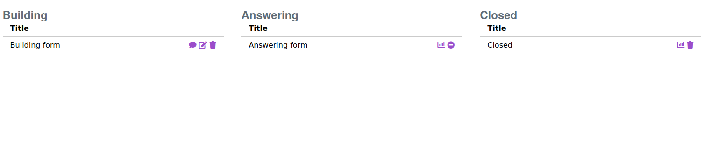
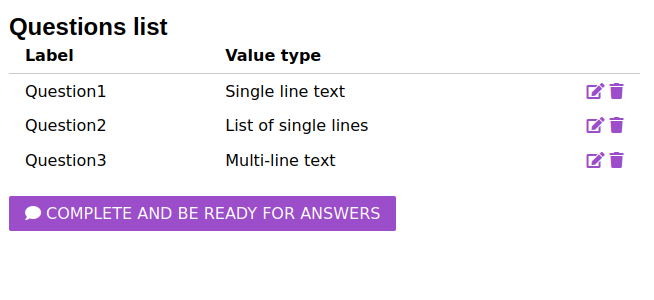

<!--
*** Thanks for checking out the Best-README-Template. If you have a suggestion
*** that would make this better, please fork the repo and create a pull request
*** or simply open an issue with the tag "enhancement".
*** Thanks again! Now go create something AMAZING! :D
***
***
***
*** To avoid retyping too much info. Do a search and replace for the following:
*** github_username, repo_name, twitter_handle, email, project_title, project_description
-->


<!-- PROJECT SHIELDS -->
<!--
*** I'm using markdown "reference style" links for readability.
*** Reference links are enclosed in brackets [ ] instead of parentheses ( ).
*** See the bottom of this document for the declaration of the reference variables
*** for contributors-url, forks-url, etc. This is an optional, concise syntax you may use.
*** https://www.markdownguide.org/basic-syntax/#reference-style-links
-->
[![Forks][forks-shield]][forks-url]
[![Stargazers][stars-shield]][stars-url]
[![Issues][issues-shield]][issues-url]
[![MIT License][license-shield]][license-url]


<!-- PROJECT LOGO -->
<br />
<p align="center">
  <a href="https://github.com/Nomeos/Looper">
    
  </a>

  <h3 align="center">Quiz looper</h3>

  <p align="center">
    A small webapp written in PHP that follows the MVC pattern.<br/>
    Its goals are to create, manage and delete quizzes.<br/>
    Users can also get some statistics related to the answers.
    <br />
    <a href="./doc"><strong>Explore the docs »</strong></a>
    <br />
    <br />
    <a href="https://github.com/Nomeos/Looper">View Demo</a>
    ·
    <a href="https://github.com/Nomeos/Looper/issues">Report Bug</a>
    ·
    <a href="https://github.com/Nomeos/Looper/issues">Request Feature</a>
  </p>
</p>


<!-- TABLE OF CONTENTS -->
<details open="open">
  <summary><h2 style="display: inline-block">Table of Contents</h2></summary>
  <ol>
    <li>
      <a href="#about-the-project">About The Project</a>
      <ul>
        <li><a href="#built-with">Built With</a></li>
        <li><a href="#architecture">Architecture</a></li>
      </ul>
    </li>
    <li>
      <a href="#getting-started">Getting Started</a>
      <ul>
        <li><a href="#prerequisites">Prerequisites</a></li>
        <li><a href="#installation">Installation</a></li>
      </ul>
    </li>
    <li><a href="#hacking-on-the-project">Hacking on the project</a></li>
    <li><a href="#hacks-used-in-this-project">Hacks used in this project</a></li>
    <ul>
      <li><a href="#css">Css</a></li>
      <li><a href="#http-requests">Http requets</a></li>
    </ul>
    <li><a href="#roadmap">Roadmap</a></li>
    <li><a href="#documentation">Documentation</a></li>
    <li><a href="#contributing">Contributing</a></li>
    <li><a href="#license">License</a></li>
    <li><a href="#contact">Contact</a></li>
  </ol>
</details>


<!-- ABOUT THE PROJECT -->
## About The Project
This project allows users to create quizzes, answer questions and look at the statistics. There are 3 types of quizzes: building, answering and closed.

A building quiz is a quiz to which questions can be added and which can be deleted. An answering quiz can only be closed and show statistics. Finally, a closed quiz can be deleted or show statistics.

There are also 3 types of questions: single line text, list of single lines and multi-line text. The only difference between them is the size of the questions labels.






### Built With

* [PHP 8.0](https://www.php.net/releases/8.0/en.php)
* [Mariadb 10.6.4](https://mariadb.com/kb/en/mariadb-1064-release-notes/)
* [Jquery 3.6](https://jquery.com/download/)
* [Dart Sass 1.45.0](https://sass-lang.com/dart-sass)
* [Composer 2.1.11](https://getcomposer.org/download/)


### Architecture
Like most web applications today, this project uses the MVC model. Interactions with the database are done by templates, html rendering is done by views and all logic is handled by controllers.

We also used a routing system that makes the URLs look nicer. The library we used is called [FastRoute](https://github.com/nikic/FastRoute). It is a simple routing library that allows us to map URLs to php functions (controller methods).

For the database modifications, we used [this](https://github.com/byjg/migration) library. It allows us to easily modify our database as most framework migration systems do. We used it because it was much easier to empty the database before doing the unit tests.

For unit testing, we used [the standard PHP library for unit tests](https://phpunit.de/).

We did not use a template engine or ORM. Instead, we developed [our own](https://github.com/Thynkon/simple-orm). At the end of this project, we realized that we should have created a query builder library to facilitate queries of the template database.


<!-- GETTING STARTED -->
## Getting Started

To get a local copy up and running follow these simple steps.

### Prerequisites
#### [Archlinux](https://archlinux.org)
- [MariaDB](https://wiki.archlinux.org/title/MariaDB#Installation)
  ```sh
  sudo pacman -S mariadb
  sudo mariadb-install-db --user=mysql --basedir=/usr --datadir=/var/lib/mysql
  ```
- [PHP](https://www.php.net/)
  ```sh
  sudo pacman -S php
  ```

- [Composer](https://getcomposer.org)
  ```sh
  sudo pacman -S composer
  ```

- [Npm](https://www.npmjs.com)
  ```sh
  sudo pacman -S nodejs
  ```

#### [NixOS](https://nixos.org/)
  ```sh
  nix-shell shell.nix
  ```

### Installation

1. Clone the repo
   ```sh
   git clone https://github.com/Nomeos/Looper.git
   ```
2. Install php packages
   ```sh
   cd Looper
   composer install
   ```

3. Install npm dependencies
    ```sh
    npm install -g sass
    ```
   
4. Compile scss files to css
   ```sh
   composer build-css
   ```

5. Setup database connection
This projects uses PDO as the database connector. In order to connect to a database, you must
set the DSN, the username and his password in **.env.php**.
   ```php
   <?php

   DEFINE('DSN', 'mysql:dbname=<YOUR_DATABASE_NAME>;host=127.0.0.1');
   DEFINE('USERNAME', '<USERNAME>');
   DEFINE('PASSWORD', '<PASSWORD>');
   ```

6. Populate the database
   ```sh
   composer populate-db
   ```

## Hacking on the project
### Tests
If you have added a feature and you want to test if everything is ok, you can run the unit tests we wrote
by typing the following:
```sh
composer test
```

## Hacks used in this project
### Css
As you can see in every folder under **resources/<folder_name>** there is a file called **style.php**.
This file is used to only load the stylesheets required by a specific view. So, every time we want to
render a view, we have to load it and store id in **$data["head"]["css"]**.

The stylesheet is stored under 'head' because html link tags can only be at html request's header.
For data that should be in header, I store it in **$data["head"]** and for data that should be in the
response's body, I store it in **$data["body"]**.
```php
<!DOCTYPE html>
<html lang="en">
<head>
    <meta charset="UTF-8">
    <meta name="viewport"
          content="width=device-width, user-scalable=no, initial-scale=1.0, maximum-scale=1.0, minimum-scale=1.0">
    <meta http-equiv="X-UA-Compatible" content="ie=edge">
    <title><?= $data["head"]["title"] ?></title>
    <link rel="stylesheet" href="https://unpkg.com/purecss@2.0.6/build/pure-min.css"
          integrity="sha384-Uu6IeWbM+gzNVXJcM9XV3SohHtmWE+3VGi496jvgX1jyvDTXfdK+rfZc8C1Aehk5" crossorigin="anonymous">
    <link rel="stylesheet" href="https://unpkg.com/purecss@2.0.6/build/grids-responsive-min.css">

    <link href="https://cdnjs.cloudflare.com/ajax/libs/font-awesome/5.15.1/css/all.min.css" rel="stylesheet"/>
    <link rel="stylesheet" href="/assets/css/lib/lib.css"/>

    <?= $data["head"]["css"] ?>
</head>
<body>
<?= $data["body"]["content"] ?>
</body>
</html>
```

### Http requests
[According to the html standard](https://stackoverflow.com/a/8054241), forms can only send GET and POST requests. To get around this limitation, we created a hidden input field that contains the http method. This practice has been adopted by most frameworks like Laravel and Symphony.

```html
<form method="post">
  <input type="hidden" name="_method" value="put" />
</form>
```

We also added an event listener on the submit form that receives the form's http method and makes an ajax request. This way we can still make PUT requests.

```js
$('form').submit(function (event) {
    event.preventDefault();

    let current_url = window.location.href;

    // Get all the forms elements and their values in one step
    let form_data_array = $(this).serializeArray();
    let form_data = $(this).serialize();
    let http_method = form_data_array.find(o => o.name === '_method').value;

    $.ajax({
        url: $(this).attr('action'),
        type: http_method,
        data: form_data,
        success: function (response) {
            window.location.replace(current_url);
        }
    });
});
```

In some cases, like the admin view, we have used a data-XXX property to specify the http method instead of using an hidden input because it would be useless to have a form with only an hidden input.

```js
const buttons = document.querySelectorAll('a[data-method]');
    let url = window.location.href;
    let publish_quiz_button_id = "publish_quiz";

    buttons.forEach(function (button) {
        button.addEventListener('click', function (event) {
            // tell the browser not to respond to the link click
            event.preventDefault();

            if (button.id === publish_quiz_button_id) {
                url = "/quiz/admin";
            }

            if (confirm('Are you sure?')) {
                doRequest(button)
                    .then(function (response) {
                        if (response.status !== 200) {
                            console.log("ERROR");
                            // ADD ERROR MESSAGE TO HTML PAGE
                        } else {
                            window.location.replace(url);
                        }
                    })
                    .catch(error => console.log("ERROR"));
            } else {
                window.location.href = url;
            }
        });
    });
```

<!-- ROADMAP -->
## Roadmap

See the [open issues](https://github.com/Nomeos/Looper/issues) for a list of proposed features (and known issues).

## Documentation
The documentation about the routing system, class diagrams, database model and the state diagram can be found under the **doc/** folder:
- [routing system](doc/routes/routes.pdf)
- [class diagrams](doc/classes/classes.pdf)
- [database model](doc/db/diagram.pdf)
- [state diagram](doc/state_diagram/state_diagram.pdf)

We use the [same directory structure as laravel](https://laravel.com/docs/8.x/structure).

<!-- CONTRIBUTING -->
## Contributing

Contributions are what make the open source community such an amazing place to learn, inspire, and create. Any contributions you make are **greatly appreciated**.

1. Fork the Project
2. Create your Feature Branch (`git checkout -b feature/AmazingFeature`)
3. Commit your Changes (`git commit -m 'Add some AmazingFeature'`)
4. Push to the Branch (`git push origin feature/AmazingFeature`)
5. Open a Pull Request


<!-- LICENSE -->
## License

Distributed under the MIT License. See `LICENSE` for more information.


<!-- CONTACT -->
## Contact

Your Name - [@twitter_handle](https://twitter.com/twitter_handle) - email

Project Link: [https://github.com/Nomeos/Looper](https://github.com/Nomeos/Looper)

<!-- MARKDOWN LINKS & IMAGES -->
<!-- https://www.markdownguide.org/basic-syntax/#reference-style-links -->
[forks-shield]: https://img.shields.io/github/forks/Nomeos/Looper
[forks-url]: https://github.com/Nomeos/Looper/network/members
[stars-shield]: https://img.shields.io/github/stars/Nomeos/Looper
[stars-url]: https://github.com/Nomeos/Looper/stargazers
[issues-shield]: https://img.shields.io/github/issues/Nomeos/Looper
[issues-url]: https://github.com/Nomeos/Looper/issues
[license-shield]: https://img.shields.io/github/license/Nomeos/Looper
[license-url]: https://github.com/Nomeos/Looper/blob/master/LICENSE
